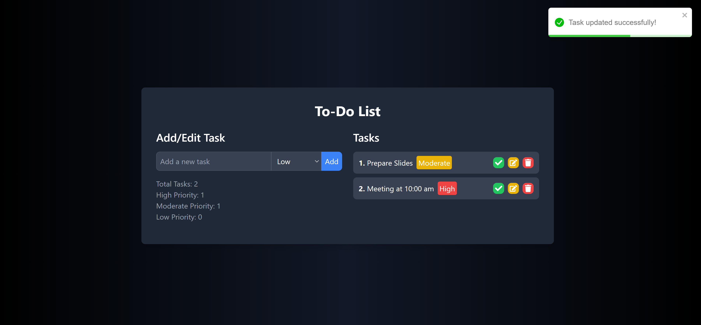

# 📝 To-Do List Application

Welcome to the To-Do List Application! This project is a modern, responsive, and user-friendly to-do list application built with React. It allows users to manage their tasks efficiently by adding, editing, deleting, and marking tasks as complete. Additionally, tasks can be prioritized as High, Moderate, or Low.

## ✨ Features

- **➕ Add Tasks**: Easily add new tasks with a priority level.
- **✏️ Edit Tasks**: Update existing tasks and their priority levels.
- **🗑️ Delete Tasks**: Remove tasks that are no longer needed.
- **✅ Mark as Complete**: Toggle tasks between complete and incomplete states.
- **📊 Task Prioritization**: Categorize tasks as High, Moderate, or Low priority.
- **📱 Responsive Design**: Works seamlessly on both desktop and mobile devices.
- **🔔 User Notifications**: Get instant feedback with toast notifications for actions.

## 🛠️ Technologies Used

- **⚛️ React**: A JavaScript library for building user interfaces.
- **🔤 React Icons**: A collection of popular icons for React applications.
- **🍞 React Toastify**: A library for providing beautiful notifications in React apps.
- **🎨 Tailwind CSS**: A utility-first CSS framework for rapid UI development.

## 📸 Screenshots

Here are some screenshots of the application:

### Home Page

## 🚀 Getting Started

Follow these instructions to get a copy of the project up and running on your local machine for development and testing purposes.

### 📋 Prerequisites

- Node.js (v12 or higher)
- npm (v6 or higher)

### 📦 Installation

1. **Clone the repository:**
   - https://github.com/MianAliKhalid/react-to-do-list.git

2. **Navigate to the project directory:**
    - cd to-do-list

3. **Install dependencies:**
    - npm install

4. **Start the development server:**
    - npm run dev

### 📚 Usage

1. **➕ Add a Task**: Click on the "Add Task" button and fill in the task details.
2. **✏️ Edit a Task**: Click on the edit icon next to the task you want to update.
3. **🗑️ Delete a Task**: Click on the delete icon next to the task you want to remove.
4. **✅ Mark as Complete**: Click on the checkbox next to the task to mark it as complete or incomplete.
5. **🔍 Filter Tasks**: Use the filter options to view tasks by their priority or completion status.

### 🤝 Contributing

Contributions are welcome! Please follow these steps to contribute:

1. Fork the repository.
2. Create a new branch (`git checkout -b feature-branch`).
3. Make your changes.
4. Commit your changes (`git commit -m 'Add some feature'`).
5. Push to the branch (`git push origin feature-branch`).
6. Open a pull request.

### 📄 License

This project is licensed under the MIT License. See the [LICENSE](LICENSE) file for details.

### 🙏 Acknowledgements

- [React](https://reactjs.org/)
- [React Icons](https://react-icons.github.io/react-icons/)
- [React Toastify](https://fkhadra.github.io/react-toastify/)
- [Tailwind CSS](https://tailwindcss.com/)

### ❤️ Made With Love

Made with ❤️ by [Mian Ali Khalid](https://github.com/MianAliKhalid)

